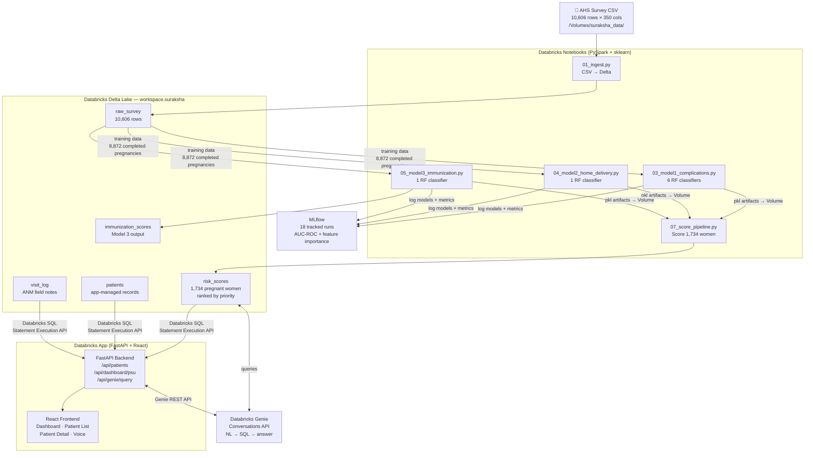
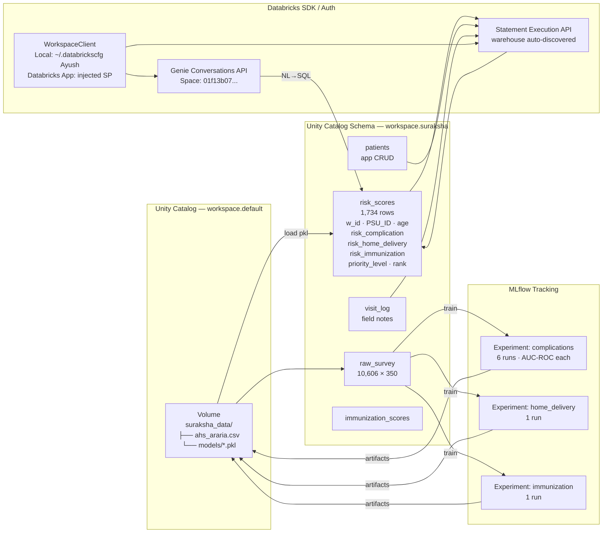
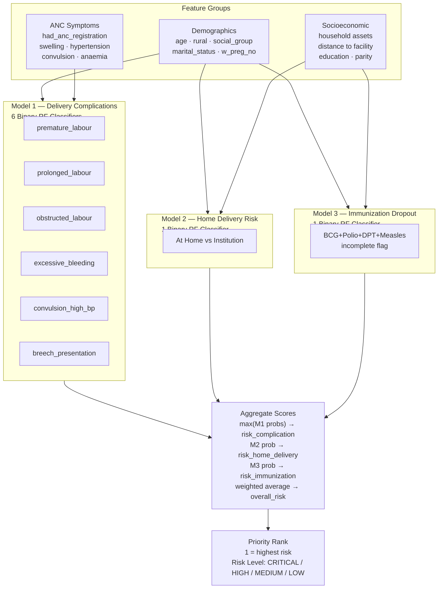

# SurakshaSakhi — Maternal Risk Intelligence

**SurakshaSakhi** predicts which pregnant women in Araria district, Bihar are at highest risk of delivery complications, home delivery, or immunization dropout — so ANMs know exactly who to visit first instead of going by geography or last contact date.

Built for **BharatBricks Hacks 2026** at IIT Indore · Track: Swatantra · April 17–18, 2026

---

## Project Write-up

SurakshaSakhi turns the Annual Health Survey dataset into a priority queue for Auxiliary Nurse Midwives. Three sklearn Random Forest classifiers trained on 8,872 completed pregnancies score each of the 1,734 currently pregnant women across delivery complications, home delivery likelihood, and immunization dropout risk. A React dashboard and a Hindi/English voice assistant powered by Databricks Genie let field workers query risk data in their own language — no SQL required.

---

## What We Built

| Layer | Technology |
|---|---|
| Data Lake | Databricks Delta Lake (Unity Catalog) |
| ML Training | sklearn RandomForest + MLflow experiment tracking |
| Model Serving | joblib artifacts on Databricks Volumes |
| Backend | FastAPI + Databricks SDK (statement execution API) |
| Frontend | React + Vite + TypeScript |
| Voice AI | Databricks Genie Conversations API (NL→SQL→speech) |
| Deployment | Databricks Apps |

---

## Databricks Technologies Used

- **Delta Lake** — raw AHS survey (`raw_survey`), scored women (`risk_scores`), patient records (`patients`), visit log (`visit_log`) — all as Delta tables under `workspace.suraksha`
- **Unity Catalog Volumes** — CSV ingestion (`/Volumes/workspace/default/suraksha_data/ahs_araria.csv`) and trained model artifacts (`/Volumes/.../models/*.pkl`)
- **MLflow** — 18 training runs tracked per notebook (AUC-ROC, feature importances, confusion matrices); models stored as run artifacts
- **Databricks SQL Statement Execution API** — backend reads/writes Delta tables at runtime via `WorkspaceClient.statement_execution`
- **Databricks Genie Conversations API** — natural language queries over `workspace.suraksha` schema; conversations persist across voice turns
- **Databricks Apps** — one-command deployment of the FastAPI + React bundle via `app.yaml`
- **Databricks SDK (Python)** — unified auth across local dev (profile `Ayush`) and Databricks Apps (injected service principal)

### Open-Source Models / Libraries
- **scikit-learn** `RandomForestClassifier` with `class_weight="balanced"` (3 model types, 8 total classifiers)
- **MLflow** open-source tracking
- **Web Speech API** (browser-native) for Hindi `hi-IN` / English `en-IN` voice input

---

## Architecture

### End-to-End Data Flow



### Databricks Components Detail



### ML Model Pipeline



---

## How to Run

### Prerequisites
- Python 3.11+, Node.js 18+
- Databricks CLI with profile `Ayush` (`~/.databrickscfg` → `https://dbc-bc7909d8-379d.cloud.databricks.com`)
- Dataset at `/Volumes/workspace/default/suraksha_data/ahs_araria.csv`

### Step 1 — Upload and Run Databricks Notebooks

```bash
# Upload all notebooks at once
databricks workspace import-dir suraksha /Workspace/suraksha \
  --format SOURCE --overwrite --profile Ayush
```

Then in the Databricks UI, run notebooks **in this order** (attach to any running cluster):

| Notebook | What it does |
|---|---|
| `01_ingest` | CSV → `raw_survey` Delta table |
| `03_model1_complications` | Train 6 RF classifiers, save pkl to Volume |
| `04_model2_home_delivery` | Train home delivery RF, save pkl |
| `05_model3_immunization` | Train immunization RF, save pkl |
| `07_score_pipeline` | Score 1,734 pregnant women → `risk_scores` |

### Step 2 — Run Locally

```bash
# Install Python dependencies
cd app
pip install -r requirements.txt

# Install Node dependencies
npm install

# Terminal 1 — Backend
uvicorn backend.main:app --reload --host 0.0.0.0 --port 8000

# Terminal 2 — Frontend (dev mode with hot reload)
npm run dev
```

- Frontend: `http://localhost:5173`
- Backend API docs: `http://localhost:8000/docs`

### Step 3 — Production Build (single port)

```bash
cd app
npm run build   # React → app/backend/static/
uvicorn backend.main:app --host 0.0.0.0 --port 8000
```

Open `http://localhost:8000`

### Step 4 — Deploy to Databricks Apps

```bash
cd app
npm run build
databricks apps deploy --profile Ayush
```

### Export notebooks from Databricks back to local

```bash
databricks workspace export-dir /Workspace/suraksha suraksha --profile Ayush
```

---

## Demo Steps

### 1. Dashboard — Village Risk Overview
1. Open the app at `http://localhost:8000` (or Databricks Apps URL)
2. The **Dashboard** tab loads automatically — a bar chart shows each PSU (village cluster) ranked by number of high-risk women
3. Click any PSU bar → filtered patient list for that village

### 2. Patient List — Prioritised Triage
1. Click the **Patients** tab
2. Table is sorted by `priority_rank` (rank 1 = most critical)
3. Risk badges: 🔴 CRITICAL · 🟠 HIGH · 🟡 MEDIUM · 🟢 LOW
4. Click any patient row → Patient Detail card

### 3. Patient Detail — Individual Risk Breakdown
1. On the detail card, see three risk bars:
   - Delivery Complications (0–1)
   - Home Delivery Risk (0–1)
   - Immunization Dropout (0–1)
2. Recommended actions are listed below based on which scores are elevated
3. Use the **Edit** button to update patient notes or visit status

### 4. Voice Assistant — Hindi/English Queries
1. Click the microphone icon (bottom right) to open the Voice Assistant
2. Click **Start Listening** and speak a query:
   - *"Show me top 5 high risk patients"*
   - *"उच्च जोखिम महिलाएं PSU 5 में"* (High risk women in PSU 5)
   - *"Which village has the most critical cases?"*
   - *"इस हफ्ते किसे पहले मिलें?"* (Who to visit first this week?)
3. Genie translates the spoken query to SQL, executes it against `risk_scores`, and speaks the answer back
4. A data table of results appears below the response

---

## Project Structure

```
bharatbricks/
├── suraksha/                        # Databricks notebooks
│   ├── 01_ingest.py                 # CSV → Delta Lake raw_survey
│   ├── 03_model1_complications.py   # 6 delivery complication classifiers
│   ├── 04_model2_home_delivery.py   # Home delivery risk classifier
│   ├── 05_model3_immunization.py    # Immunization dropout classifier
│   ├── 07_score_pipeline.py         # Score 1,734 pregnant women → risk_scores
│   └── 08_llm_explanations.py       # LLM-generated risk explanations
│
└── app/                             # Databricks App (FastAPI + React)
    ├── app.yaml                     # Databricks Apps config
    ├── requirements.txt
    ├── package.json
    │
    ├── backend/
    │   ├── main.py                  # FastAPI entrypoint
    │   ├── database.py              # Databricks SQL Statement Execution API
    │   ├── scoring.py               # joblib model loading + inference
    │   ├── preprocessing.py         # Shared feature engineering
    │   ├── schemas.py               # Pydantic models
    │   └── routers/
    │       ├── patients.py          # GET/POST/PATCH /api/patients
    │       ├── dashboard.py         # GET /api/dashboard/psu
    │       ├── batch.py             # POST /api/score/batch
    │       └── genie.py             # POST /api/genie/query → Genie API
    │
    └── frontend/src/
        ├── App.tsx
        ├── api/client.ts
        ├── types.ts
        └── components/
            ├── Dashboard.tsx        # PSU bar chart
            ├── PatientList.tsx      # Sortable priority table
            ├── PatientDetail.tsx    # Individual risk breakdown
            ├── PatientForm.tsx
            ├── PatientCard.tsx
            ├── RiskBar.tsx
            └── VoiceAssistant.tsx   # Hindi/English voice + Genie
```

---

## Delta Tables

| Table | Rows | Description |
|---|---|---|
| `workspace.suraksha.raw_survey` | 10,606 | Raw AHS CSV (350 columns) |
| `workspace.suraksha.risk_scores` | 1,734 | Scored pregnant women with priority rank |
| `workspace.suraksha.immunization_scores` | ~1,734 | Model 3 detailed output |
| `workspace.suraksha.patients` | ~1,734 | App-managed patient records |
| `workspace.suraksha.visit_log` | — | ANM field visit notes |

---

## ML Models

| Model | Classifiers | Target | Training rows | Eval metric |
|---|---|---|---|---|
| Model 1 | 6× Binary RF | Delivery complications | 8,872 | AUC-ROC per complication |
| Model 2 | 1× Binary RF | Home delivery vs facility | 10,175 | AUC-ROC + Sensitivity |
| Model 3 | 1× Binary RF | Immunization incomplete | ~8,500 | AUC-ROC |

All models: `class_weight="balanced"` · CPU-only · stored as joblib `.pkl` on Databricks Volumes.

---

## Voice Assistant

- **Genie Space ID:** `01f13b07fc7515a6baf7db7d21088387`
- **Languages:** Hindi (`hi-IN`) and English (`en-IN`) via Web Speech API
- **Auth:** `WorkspaceClient` auto-selects service principal on Databricks Apps, `~/.databrickscfg` profile `Ayush` locally
- **Flow:** Speech → text → `POST /api/genie/query` → Genie Conversations API → SQL on `risk_scores` → spoken answer + data table

---

## Team

Built at BharatBricks Hacks 2026, IIT Indore.
Databricks workspace: `https://dbc-bc7909d8-379d.cloud.databricks.com`
